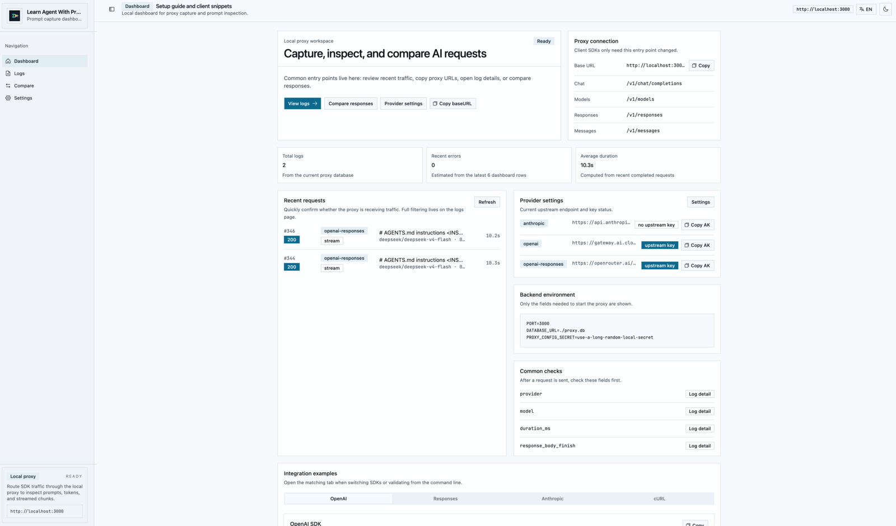
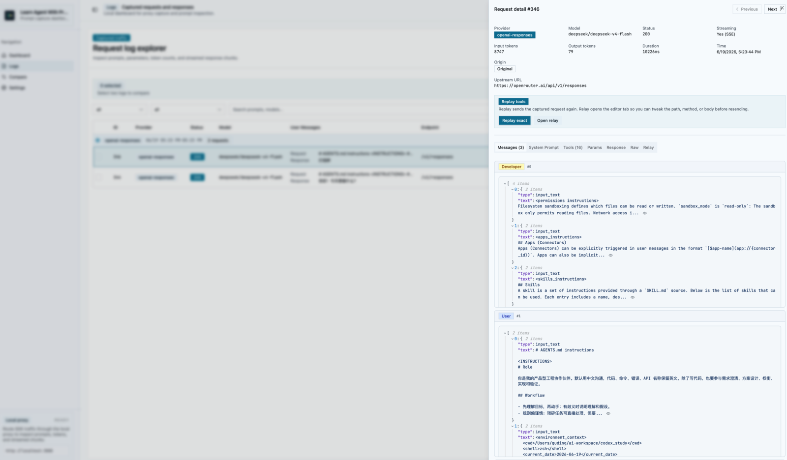

# Learn Agent With Proxy

本地 AI API 代理和请求观测台。把客户端 SDK 的 `baseURL` 指向本地代理后，它会继续转发请求，同时记录 prompt、messages、tools、params、响应、token、耗时、SSE 流式分块和 upstream URL。

适合用来学习成熟 Agent 的请求结构，也适合调试自己的 prompt、tool schema 和模型响应差异。



## 快速开始

```bash
pnpm install
pnpm dev
```

打开前端页面：

```txt
http://localhost:5173
```

后端代理入口：

```txt
http://localhost:3000/v1
```

## 接入方式

1. 在 `Settings` 里配置 provider 的 upstream URL 和 upstream API key。
2. 复制该 provider 的本地 access key。
3. 客户端 SDK 使用本地代理地址和本地 access key 发请求。

OpenAI SDK 示例：

```ts
import OpenAI from "openai";

const client = new OpenAI({
  baseURL: "http://localhost:3000/v1",
  apiKey: "<access-key-from-settings>",
});

await client.chat.completions.create({
  model: "gpt-4o-mini",
  messages: [{ role: "user", content: "Hello" }],
});
```

Anthropic、OpenAI Responses 和兼容 OpenAI 风格的服务也走同一个本地入口；具体 provider 由本地 access key 对应的配置决定。

## 能看到什么

- `Dashboard`: 最近请求、provider 状态、baseURL 和 access key 复制入口。
- `Logs`: 请求列表、状态、模型、耗时、token、流式标记和搜索过滤。
- `Log detail`: messages、system prompt、tools、params、response、raw JSON、replay/relay。
- `Compare`: 选择两条日志，对比请求结构、响应和关键指标。



## 常用命令

```bash
pnpm dev          # 同时启动后端和前端
pnpm dev:backend  # 只启动后端
pnpm dev:webui    # 只启动前端
pnpm build        # 构建前后端
```

更多维护细节看：

- [本地运行](docs/development.md)
- [架构说明](docs/architecture.md)
- [策略扩展](docs/strategy-design.md)
- [学习指南](docs/learning-guide.md)
